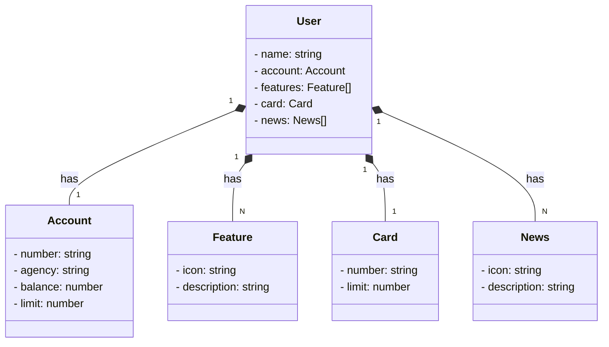

# api-rest-java-spring3
Java RESTful API created for santander bootcamp

## Class Diagram

```mermaid
classDiagram
  class User {
    - name: string
    - account: Account
    - features: Feature[]
    - card: Card
    - news: News[]
  }

  class Account {
    - number: string
    - agency: string
    - balance: number
    - limit: number
  }

  class Feature {
    - icon: string
    - description: string
  }

  class Card {
    - number: string
    - limit: number
  }

  class News {
    - icon: string
    - description: string
  }

  User "1" *-- "1" Account : has
  User "1" *-- "N" Feature : has
  User "1" *-- "1" Card : has
  User "1" *-- "N" News : has
```

